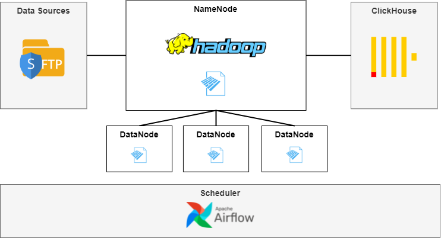

## Phase 1

It was built using [docker compose](docker-compose.yml) to set up SFTP, HDFS and ClickHouse services. The SFTP connector, data transformer and data loader can be found at [etl](etl) folder.

## Phase 2

All the answers and queries can be found at [answers.sql](answers.sql).

## Phase 3

I actually wanted to take the opportunity to build this project and build a prove of concept using ClickHouse connected to HDFS. I spent a lot of time building all the dockers and scripts to achieve this. Above is my architecture diagram.

 

 

### Connectors, transformer and loader

I like to code Python always thinking about the progress of the project. You can see this at [etl](etl). To call this etl module, I would implement a command line interface using the Argparse module. The CLI is an awesome way to implement custom module calls.

### Airflow
Once we have the CLI I would call it after 2am using Airflow. The Airflow is powerfull tool to scheduling and handling dependencies across multi tasks.

### HDFS
The Hadoop File System is an amazing way to more securely persist data across various commodities and cheap hardware. The goal here is to ingest data into a land zone, clean the data, store it, and create a raw backup.

### Parquet
The [transformer](etl/transformers) transforms the data to Parquet format. Apache Parquet is designed to bring efficient columnar storage of data compared to row-based files like CSV. It reduce the I/O of disk and increase the run time.

### ClickHouse
Once the data is available in HDFS, we can extract value from it. ClickHouse is a great Data Warehouse designed for big data metrics calculations. I like the ELT approach. So I would load the data into ClicHouse and do some transformations there. There are many methods and table engines to calculate metrics in real time. It can be a good way to extract value from the data.